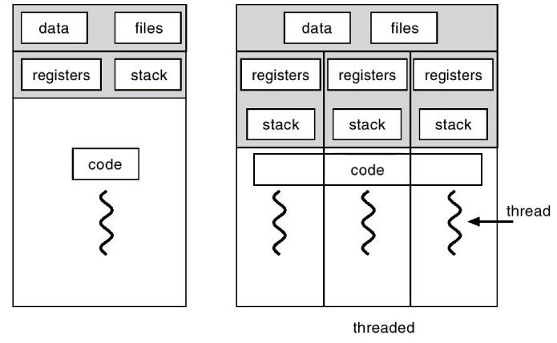

# Многопоточность, многопроцессорность и асинхронность

## Процесс и потоки

Процесс - исполняемый экземпляр какой-либо программы. Каждый процесс состоит из следующих элементов:

+ Образ машинного кода
+ Область памяти, в которую включается исполняемый код, данные процесса (входные и выходные данные), стек вызовов и куча (для хранения динамически создаваемых данных)
+ Дескрипторы операционной системы (например, файловые дескрипторы)
+ Состояние процесса

В целях стабильности и безопасности, в современных операционных системы каждый процесс имеет прямой доступ только с своим собственным ресурсам. Доступ к ресурсам другого процесса возможен через межпроцессное взаимодействие (например, посредством файлов, при помощи именованных и неименованных каналов и другие).

Сам процесс может быть разделен на так называемые потоки. Поток (поток выполнения, thread) - наименьшая единица обработки, исполнение которой может быть назначено ядром операционной системы. В отличии от нескольких процессов, потоки существуют внутри одного процесса и имеют доступ к ресурсам этого процесса. Каждый поток обладет собственным набором регистров и собственным стеком вызова, но доступ к ним имеют и другие потоки.



При работе с потоками стоит учесть несколько моментов:

+ Одно ядро процессора в один момент может исполнять только один поток
+ Потоки одного процесса могут исполняться физически одновременно (на разных ядрах)
+ Бессмысленно порождать потоков больше, чем у вас есть ядер.

Потоки имеют несколько применений:

+ Первое - ускорение работы программы. Ускорение достигается за счет параллельного выполнения независимых друг от друга вычислений. Например, при численном интегрировании область интегрирования может быть разбита на 3 участка. На каждый участок создается свой поток, в котором численно вычислется интеграл для конкретного участка
+ Второе - независимое исполнение операций. Отличие этого случая от первого хорошо видно на следующем примере. Пусть есть приложение с графическим интерфейсом, где весь код выполняется в одном потоке. При выполнении какой-нибудь долгой операции (например, копирование файла) интерфейс приложения просто перестанет отвечать до тех пор, пока долгий процесс не завершится. В таком случае в один поток помещается работа графического интерфейса, в другой - остальные вычисления. В таком случае интерфейс позволит проводить другие операции даже во время выполнения долгой операции в другом потоке (например, заполнение прогресс бара в процессе копирования файла).

### Разница между потоками и процессами

Поток - это независимая последовательность выполнения каких то вычислений. Поток thread делит выделенную память ядру процессора, а также его процессорное время со всеми другими потоками, которые создаются программой в рамках одного ядра процессора. Программы на языке Python имеют, по умолчанию, один основной поток. Можно создать их больше и позволить Python переключаться между ними. Это переключение происходит очень быстро и кажется, что они работают параллельно.

Понятие процесс - представляет собой также независимую последовательность выполнения вычислений. В отличие от потоков, процесс имеет собственное ядро и следовательно выделенную ему память, которое не используется совместно с другими процессами. Процесс может клонировать себя, создавая два или более экземпляра в одном ядре процессора.

## threading

В Python работа с потоками осуществляется при помощи стандартной библиотеки `threading`. В библиотеке представлен класс `Thread` для создания потока выполнения. Задание исполняемого кода в отдельном потоке возможно двумя способами:

+ Передача исполняемого объекта (функции) в конструктор класса
+ Переопределение функции `run` в классе-наследнике

После того, как объект создан, поток запускается путем вызова метода `start`. Рассмотрим простой пример:

```python
import threading


def thread_job(number):
    print('Hello {}'.format(number))


def run_threads(count):
    threads = [threading.Thread(target=thread_job, args=(i,)) for i in range(0, count)]
    for thread in threads:
        thread.start()
        thread.join()


run_threads(4)
print('finish')
```
Конструктор класса Thread имеет следующие аргументы:

+ `group` должно быть `None`; зарезервировано для будующих реализаций Python
+ `target` является исполняемым объектом (по умолчанию равен `None`, ничего не исполняется)
+ `name` обозначет имя потока (по умолчанию имя генерируется автоматически)
+ `args` - кортеж аргументов для исполняемого объекта
+ `kwargs` - словарь именованных аргументов для исполняемого объекта
+ `daemon` равное `True` обозначет служебный поток (служебные потоки завершаются принудительно при завершении процесса); по умолчанию `False`

### GIL

У Python есть одна особенность, которая усложняет параллельное выполнение кода. Она называется GIL, сокращенно от Global Interpreter Lock. GIL гарантирует, что в любой момент времени работает только один поток. Из этого следует, что с потоками невозможно использовать несколько ядер процессора.

GIL был введен в Python потому, что управление памятью CPython не является потокобезопасным. Имея такую блокировку Python может быть уверен, что никогда не будет условий гонки.

+ Состояние гонки возникает, когда несколько потоков могут одновременно получать доступ к общей структуре данных или местоположению в памяти и изменять их, вследствии чего могут произойти непредсказуемые вещи. Пример из жизни: если два пользователя одновременно редактируют один и тот же документ онлайн и второй пользователь сохранит данные в базу, то перезапишет работу первого пользователя. Чтобы избежать условий гонки, необходимо заставить второго пользователя ждать, пока первый закончит работу с документом и только после этого разрешить второму пользователю открыть и начать редактировать документ
+ Потокобезопасность работает путем создания копии локального хранилища в каждом потоке, чтобы данные не сталкивались с другим потоком

Некоторые модули, как стандартные, так и сторонние, созданы для освобождения GIL при выполнении тяжелых вычислительных операций (например, сжатие или хеширование). К тому же, GIL всегда свободен при выполнении операций ввода-вывода.

## multiprocessing

Библиотека `multiprocessing` позволяет организовать параллелизм вычислений за счет создания подпроцессов. Т.к. каждый процесс выполняется независимо от других, этот метод параллелизма позволяет избежать проблем с GIL. Предоставляемый библиотекой API схож с тем, что есть в `threading`, хотя есть уникальные вещи. Создание процесса происходит поутем создания объекта класса `Process`. Аргументы конструктора аналогичны тем, что есть в конструкторе `Thread`. В том числе аргумент `daemon` позволяет создавать служебные процессы. Служебные процессы завершаются вместе с родительским процессом и не могут порождать свои подпроцессы.

Простой пример работы с библиотекой:

```python
from multiprocessing import Process
import os


def info(title):
    print(title)
    print('module name:', __name__)
    print('parent process:', os.getppid())
    print('process id:', os.getpid())


def f(name):
    info('function f')
    print('hello', name)


info('main line')
p = Process(target=f, args=('bob',))
p.start()
p.join()
```

## Асинхронность

Асинхронность — это возможность выполнения программой задач и процессов без ожидания их завершения. То есть если предыдущий процесс все еще находится на этапе выполнения, асинхронная программа может легко перейти к обработке следующих задач.

### Пример

Предположим, у нас есть две функции в каждой из которых есть некая "быстрая" операция (например, арифметическое вычисление) и "медленная" операция ввода/вывода. Детали реализации медленной операции нам сейчас не важны. Будем моделировать ее функцией time.sleep(). Наша задача - выполнить обе задачи как можно быстрее.

```python
import time

def timer(func):
    def wrapper(*args, **kwargs):
        t1 = time.time()
        func(*args, **kwargs)
        t2 = time.time()
        print(f'Function {func.__name__!r} executed in {(t2-t1):.4f}s')
    return wrapper

@timer
def fun1(x):
    print(x**2)
    time.sleep(3)
    print('fun1 завершена')

@timer
def fun2(x):
    print(x**0.5)
    time.sleep(3)
    print('fun2 завершена')


fun1(4)
fun2(4)
```

Никаких сюрпризов - fun2 честно ждет пока полностью отработает fun1 (и быстрая ее часть, и медленная) и только потом начинает выполнять свою работу. Весь процесс занимает 3 + 3 = 6 секунд.

Теперь попробуем сделать то же самое, но в асинхронном режиме.

```python
import time
import asyncio

def timer(func):
    async def wrapper(*args, **kwargs):
        t1 = time.time()
        await func(*args, **kwargs)
        t2 = time.time()
        print(f'Function {func.__name__!r} executed in {(t2-t1):.4f}s')
    return wrapper

@timer
async def fun1(x):
    print(x**2)
    await asyncio.sleep(3)
    print('fun1 завершена')

@timer
async def fun2(x):
    print(x**0.5)
    await asyncio.sleep(3)
    print('fun2 завершена')

async def main():
    task1 = asyncio.create_task(fun1(4))
    task2 = asyncio.create_task(fun2(4))

    await task1
    await task2


asyncio.run(main())
```

Мгновенно выполнились быстрые части обеих функций и затем через 3 секунды (3, а не 6!) одновременно появились оба текстовых сообщения. Полное ощущение, что функции выполнились параллельно (на самом деле нет).

1. Перед определениями функций появился префикс async. Он говорит интерпретатору, что функция должна выполняться асинхронно
2. Вместо привычного time.sleep мы использовали asyncio.sleep. Это "неблокирующий sleep". В рамках функции ведет себя так же, как традиционный, но не останавливает интерпретатор в целом
3. Перед вызовом асинхронных функций появился префикс await. Он говорит интерпретатору выполнять другие задачи и ожидать ответа
4. На базе функций мы при помощи asyncio.create_task создали задачи и запустили все это при помощи asyncio.run

Как это работает:

1. Выполнилась быстрая часть функции fun1
2. fun1 сказала интерпретатору "иди дальше, я посплю 3 секунды"
3. Выполнилась быстрая часть функции fun2
4. fun2 сказала интерпретатору "иди дальше, я посплю 3 секунды"
5. Интерпретатору дальше делать нечего, поэтому он ждет пока ему маякнет первая проснувшаяся функция
6. На доли миллисекунды раньше проснулась fun1 (она ведь и уснула чуть раньше) и отрапортовала нам об успешном завершении
7. То же самое сделала функция fun2

## Более реальный пример

```python
import asyncio


# имитация  асинхронного соединения с некой периферией
async def get_conn(host, port):
    class Conn:
        async def put_data(self):
            print('Отправка данных...')
            await asyncio.sleep(2)
            print('Данные отправлены.')

        async def get_data(self):
            print('Получение данных...')
            await asyncio.sleep(2)
            print('Данные получены.')

        async def close(self):
            print('Завершение соединения...')
            await asyncio.sleep(2)
            print('Соединение завершено.')

    print('Устанавливаем соединение...')
    await asyncio.sleep(2)
    print('Соединение установлено.')
    return Conn()


class Connection:
    # этот конструктор будет выполнен в заголовке with
    def __init__(self, host, port):
        self.host = host
        self.port = port

    # этот метод будет неявно выполнен при входе в with
    async def __aenter__(self):
        self.conn = await get_conn(self.host, self.port)
        return self.conn

    # этот метод будет неявно выполнен при выходе из with
    async def __aexit__(self, exc_type, exc, tb):
        await self.conn.close()


async def main():
    async with Connection('localhost', 9001) as conn:
        send_task = asyncio.create_task(conn.put_data())
        receive_task = asyncio.create_task(conn.get_data())

        # операции отправки и получения данных выполняем конкурентно
        await send_task
        await receive_task


asyncio.run(main())
```